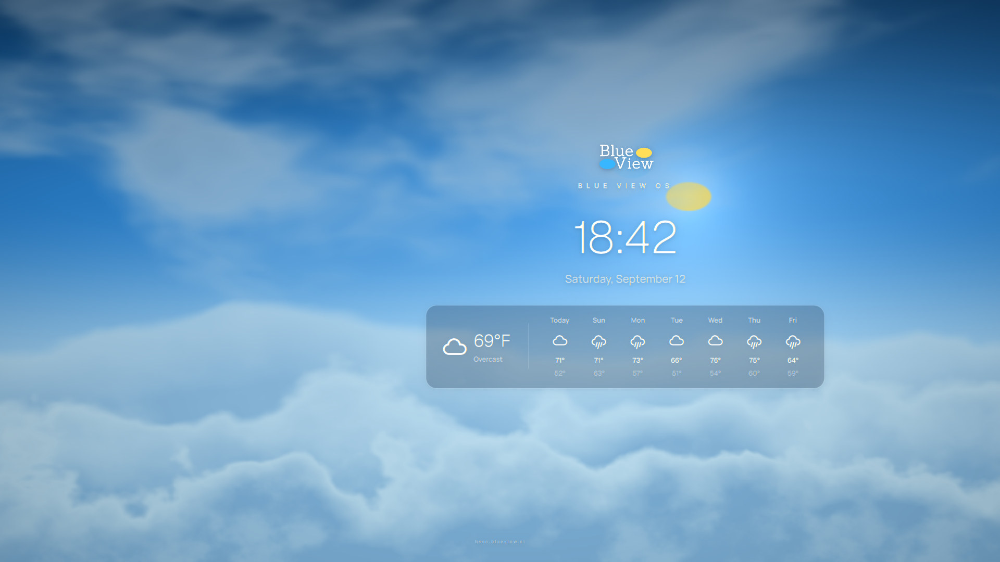
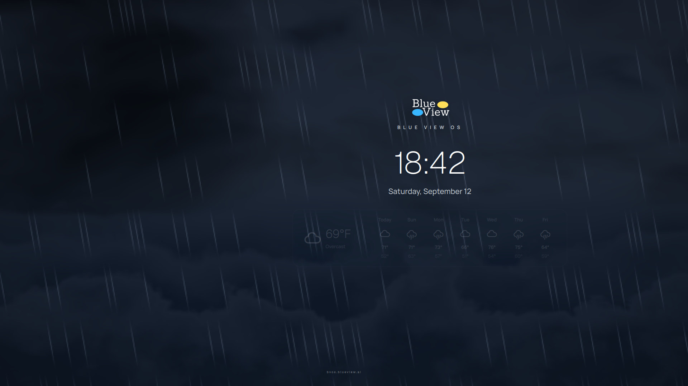
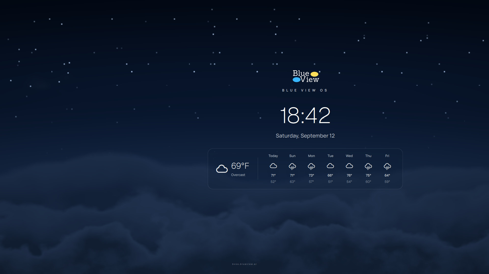
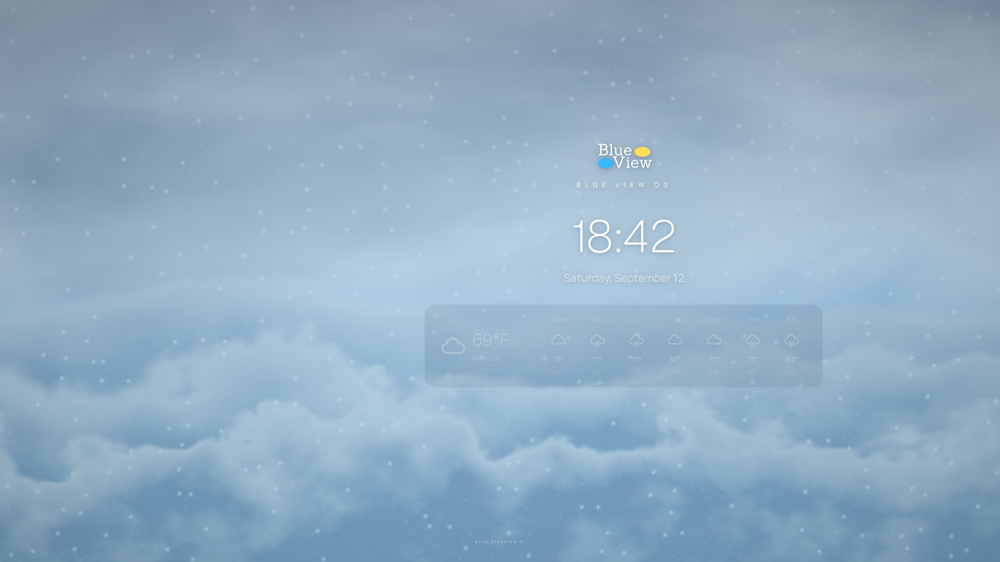

# Blue View OS Desktop

The Blue View OS look for [Omarchy](https://omarchy.org) (Arch Linux + Hyprland):
glass title bars on every window, the **Blue View OS** theme, and a living
above-the-clouds sky, on the desktop and as the screensaver, driven by real
astronomy, real weather and real wind.



| Storm at night | Clear night | Snow |
| --- | --- | --- |
|  |  |  |

## What you get

### Glass title bars
- A slim, 20px bar on every window. It's almost fully transparent over a blur, so it takes on the color of your desktop.
- macOS-style dots on the left for **minimize**, **maximize** and **float**. **Close** sits alone on the far right. Icons only appear when you hover.
- Double-click a title bar to maximize. Minimized windows go to a tray: **SUPER + M** shows it, and the yellow dot restores a window.
- The bars come from [hyprbars](https://github.com/hyprwm/hyprland-plugins/tree/main/hyprbars), with a small patch that lets each button sit on either side. The plugin is built against your installed Hyprland headers, so no `hyprpm` or `sudo` is needed. It rebuilds automatically after `omarchy update`.

### Window snapping
- Drag any window by its title bar, or with **SUPER + drag**, and let go at a screen edge, like on Windows:
  - **Left or right edge:** that half of the screen
  - **Top edge:** maximized
  - **Bottom edge:** the bottom half
  - **A corner:** that quarter
- While you hold a window at an edge, a clear glass outline shows where it will land.
- Tiled windows snap too: they float into place. Drag a snapped window away and it returns to its earlier size.
- A small plugin built against your installed Hyprland headers, like the title bars, and rebuilt after `omarchy update`.

### Blue View OS theme
- Brand navy glass, with the logo's blue (`#38b6ff`) and yellow (`#ffde59`) as accents.
- Window borders use a subtle blue-to-yellow gradient.
- Three wallpapers rendered from the screensaver sky: day, golden hour and night.

### A real sky, above the clouds
The same living sky is your desktop background and your screensaver. It's dark on screen when it's dark outside.

- **The sun and moon are the logo's ovals,** placed where they really are in your sky. Positions come from standard ephemeris formulas (Meeus) for your latitude, longitude and time, including atmospheric refraction near the horizon. The moon shows its real phase.
- **Real stars.** The 2,887 naked-eye stars of the Yale Bright Star Catalogue are precessed to today, placed by local sidereal time, and colored by their B-V index. They come out in order of brightness as twilight deepens, turn with the Earth, and hide behind moonlight, overcast and daylight. Constellation lines are optional and off by default.
- **Real satellites.** The International Space Station, China's Tiangong station and the brightest satellites are propagated with SGP4 from current CelesTrak elements. Each one appears only when it's truly visible from where you are: above the horizon, sunlit, against a dark sky.
- **Clouds follow the real weather** (cover, overcast, rain, storms, snow, fog) **and the real wind.** Wind is scaled from 10 m up to cloud height with the 1/7 power law. Cloud motion follows the geometry of the viewpoint: distant clouds near the horizon barely creep, nearer ones slide by, and wind toward or away from you makes clouds recede or approach.
- **The view** is a 200° panorama facing the equator, from about 1 km above a sea of clouds. The sun and moon ovals are drawn logo-sized for the brand; their positions and motion are real.
- **Golden-ratio composition.** The logo, clock and forecast share one axis at 1/φ across the screen, sit on the golden lines, and scale their type in powers of φ.
- **Current weather and a 7-day forecast** on a clear-glass card that slowly breathes in and out on a 15-second cycle.
- Renders the clouds at reduced resolution and draws the stars sharp. The desktop animates smoothly while you can see it and redraws only occasionally while windows cover it, so it stays light even on older integrated GPUs.
- Closes on any key or mouse movement, respects idle inhibitors and Omarchy's stay-awake toggle, and never starts over the lock screen. Omarchy still locks at `idle.lock`.

## On Windows

The live sky also runs on Windows 10 and 11 as a desktop background and screensaver, through the free [Lively Wallpaper](https://www.rocksdanister.com/lively) app. See [windows/README.md](windows/README.md).

## Requirements

- Omarchy with Hyprland 0.55 or newer (Lua config)
- `jq`, `curl`, `git`, `make`, `g++`, `pkg-config`: all present on a standard Omarchy install
- `qt6-shadertools` (optional): if it's installed, the shader is recompiled locally

## Install

```bash
git clone https://github.com/frank-blueview-ai/Blue-View-Window-Theme-Omarchy.git
cd Blue-View-Window-Theme-Omarchy
./install.sh            # or ./install.sh --no-theme to keep your current theme
```

The script backs up `hyprland.lua` and `shell.json` before editing them.

## Use

| What | How |
| --- | --- |
| Minimize / maximize / float | Left dots on the title bar |
| Close | Right dot on the title bar |
| Show minimized windows | `SUPER + M` |
| Snap a window | Drag it to a screen edge or corner and let go |
| Snap settings | `plugin.bvos_snap` in `~/.config/hypr/bvos-windows.lua` (`enabled`, `edge`, `corner`, `preview_color`) |
| Screensaver delay | `idle.screensaver` in `~/.config/omarchy/shell.json` (seconds) |
| Start the screensaver | `omarchy-shell bvos-screensaver show` |
| Preview any weather and hour | `omarchy-shell bvos-screensaver preview <clear\|partly\|cloudy\|overcast\|rain\|storm\|snow\|fog\|live> <0-23\|now>` |
| Demo that ignores input | `omarchy-shell bvos-screensaver demo storm 22`, then `... hide` |
| Live sky desktop on / off | `omarchy-shell bvos-screensaver desktop <on\|off>` |
| Constellation lines on / off | `omarchy-shell bvos-screensaver lines <on\|off>` |
| Inspect the computed sky | `omarchy-shell bvos-screensaver sky` |
| Rebuild the title-bar plugin | `bvos-hyprbars-build --load` |
| Rebuild the snapping plugin | `bvos-snap-build --load` |

Weather uses the location set in Omarchy's weather widget. Current conditions, wind and coordinates come from [wttr.in](https://wttr.in); the 7-day forecast comes from [Open-Meteo](https://open-meteo.com); satellite orbits come from [CelesTrak](https://celestrak.org).

## Layout of this repo

```
bin/                 bvos-window-minimize, bvos-hyprbars-build, bvos-snap-build
hypr/                bvos-windows.lua (title bars, buttons, blur, SUPER + M)
hyprbars/            per-button alignment patch for hyprbars
snap/                window-snapping plugin (C++, built against the installed Hyprland)
hooks/               Omarchy post-update hooks that rebuild the plugins
omarchy/plugins/     bvos.screensaver: Quickshell service, sky shader (sky.glsl), astronomy
                     (Astro.js), stars, satellites (SGP4), weather
omarchy/themes/      blue-view-os theme
web/                 the same sky as a web page (WebGL 2), built from the Omarchy plugin sources
windows/             Lively Wallpaper package for Windows
```

## Uninstall

```bash
./uninstall.sh
```

## License

Copyright (c) 2026 **The Blue View Group Corporation**. Author: **Frank Perez** <frank@blueview.ai>

Licensed under the [PolyForm Noncommercial License 1.0.0](LICENSE). You may use, modify and share this software for noncommercial purposes. Commercial use requires a separate license from The Blue View Group Corporation; contact frank@blueview.ai.

"Blue View", "Blue View OS" and the Blue View logo are trademarks of The Blue View Group Corporation. The hyprbars patch keeps its upstream BSD 3-Clause license. See [NOTICE](NOTICE) for third-party details.
